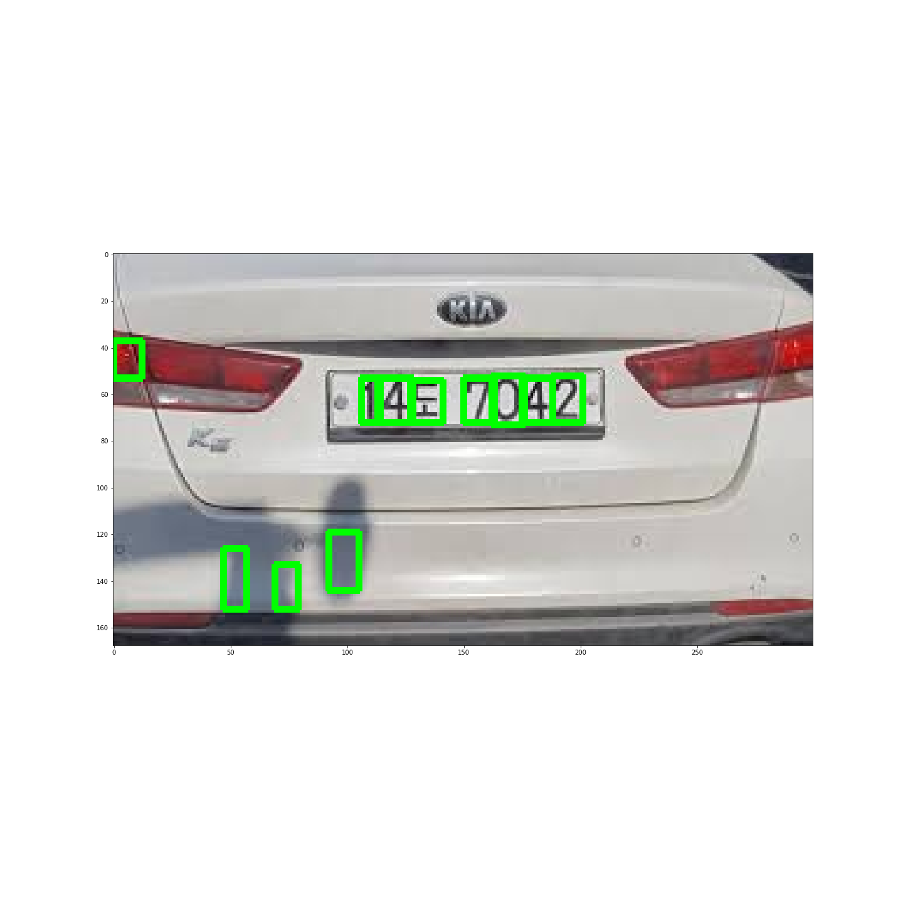

# 차량 번호판 인식기 만들기

시작하기 전 구상한 프로세스는 다음과 같다.

* 이미지 불러오기(grayscale로 변환)

* 전처리 (Gaussian blur로 edge 강조하기, threshold(adaptive), morphology, canny) 

* 원하는 영역 찾아내기(contour)

* 이미지 평면화 (affine transform, warp) *필요시

* pytesseract 라이브러리 이용

* 결과값 = (차 번호, 용도, 차종) 출력

* 결과값 출력이후, 번호판 모자이크 처리

위 과정을 생각하고 프로젝트를 진행했다.

## < 첫 구상과 달랐던 점 >

cv2.Canny의 경우에는 사용하지 않았다. 오히려 cv2.adaptiveThreshold나 morph중 하나인 cv2.MORPH_TOPHAT을 사용하여 이미지를 전처리 하는 것이 성능이 좋았다.

그 외에는 별 다른 점이 없었다.

## < 과정 > 

** 인터넷에서 다운로드 한 사진입니다. 혹시나 차주분이 불쾌하시다면 내리겠습니다!

구글링을 하며 코드를 참조하고 OpenCV Tutorial을 참조했습니다.
자세한 설명은 코드에 주석으로 달아두었습니다!

## 1. 먼저 이미지를 불러오고, Grayscale 처리를 합니다.

## 2. 여러 이미지 전처리 적용해보기

## 3. Contours 찾기

## 4. Contours 추리기

## 5. 번호판 영역만 추출하기

## 6.필요시 번호판 회전시키기

## 7. 차종, 용도 파악하기

## 8. 번호판 모자이크 하기

